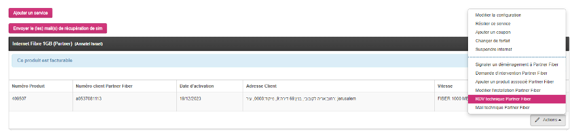
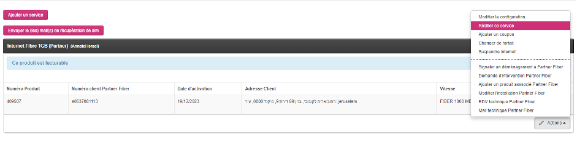

# Internet

## HOT

### Quelles informations sur le routeur
Les voyants sur le boîtier internet peuvent être d’une grande aide pour déterminer l’origine de la panne. Il est possible de voir si le boitier est allumé ou éteint, l’infrastructure, si le boitier est connecté à internet ou encore si le Wi-Fi est activé. Sur les Hotbox 5 il faut appuyer sur le bouton info pour faire apparaître les voyants. Les voyants différent en fonction du modèle de boîtiers.  
- Hot Box 2 (200 MB): L’infrastructure est représentée par deux voyants: une flèche vers le haut et une vers le bas. La connexion internet est symbolisée par le signe @. Pour le Wi-Fi il est simplement écrit Wi-Fi.  
{: width="800px" } 

- Hot Box 4 (500 MB): L’infrastructure est représentée par le signe “S”. Pour le reste c’est identique au Hot Box 2.  
{: width="800px" } 

- Hot Box 5 / 5f: L’infrastructure est représentée par DS/US. L’@ est remplacé par “Internet” et pour le Wi-Fi c’est identiques aux boîtiers précédents.    
{: width="800px" } 

Dans la grande majorité des cas, si le voyant correspondant à l'infrastructure clignote et celui de la connexion internet est éteint, il s’agit d’une panne de secteur.  

### Numéro de client HOT (MASAP)
Chacun de nos clients possédant un abonnement internet via HOT, ont attribué un numéro de client HOT unique. Ce numéro de client est visible sur le Backoffice ou sur la facture du client. C’est à l'aide de ce MASAP que les conseillers technique de HOT identifient nos clients. Il est donc nécessaire de l’avoir sous les yeux lorsqu’on appelle HOT afin de leur communiquer.  
{: width="800px" } 

### Pas d’internet à la maison
Lorsqu’un client nous contacte car il n’a plus internet a la maison, la première chose à faire est de lui demander quels sont les voyants allumés sur le boîtier internet et de débrancher puis rebrancher le câble d’alimentation. Ces opérations sont importantes car si lorsque le client rebranché le boîtier il n’arrive toujours pas à se connecter a internet alors il faut contacter HOT et leur communiquer le numéro de client (MASAP voir plus haut), les voyants allumés ainsi que les opérations effectuées avec le client. Le technicien HOT en ligne va essayer de déterminer l’origine du problème et de le résoudre en effectuant des manipulations à distance sur le boîtier (Réinitialisation, mise à jour, redémarrage…). Dans certains cas cela suffit à faire fonctionner internet à la maison, dans d’autres il est nécessaire de faire intervenir un technicien (voir plus bas) directement sur place. Il faut donc vérifier les disponibilités du clients et le ou les numéro sur lequel ce dernier est joignable par le technicien. S'il s’agit simplement d’une panne de secteur, le technicien peut nous communiquer le délai de résolution de la panne. A noter, les intempéries provoquent souvent des pannes de secteur ou une connexion internet instable.

### Manipulations à effectuer sur le modem en étant ligne avec HOT
Dans certains cas, le technicien HOT en ligne peut demander au client d’effectuer quelques manipulations. Si certaines manipulations sont assez simples comme débrancher et rebrancher le câble d’alimentation ou le câble réseau (coaxial), certaines sont plus inhabituelles notamment le hard reset. En effet dans certains cas le Hard reset peut être la solution ou en tout cas confirmer la nécessité de faire venir un technicien. Pour ce faire, il faut un objet fin et pointu (cure dent,couteau, trombone..) et maintenir le bouton reset jusqu'à ce que les voyants s'éteignent.

### Pannes répétitives
Si un client continue à rencontrer des problèmes récurrents malgré nos interventions et les solutions habituelles, nous devons envisager des approches plus radicales pour résoudre définitivement le problème.  
Cela peut inclure plusieurs options:  
- Remplacer le modem actuel par un routeur de nouvelle génération pour une meilleure performance.  
- Si possible, passer à la fibre optique ou à un forfait internet plus performant, en fonction de l'éligibilité du client à la fibre.  
- Envisager un changement de fournisseur d'accès internet(passage chez partner dans ce cas), soit parce qu'un seul des deux opérateurs dispose de l'infrastructure fibre à l'adresse du client, soit parce que l'opérateur actuel ne fournit pas un service performant et que les problèmes persistent. C’est un des nombreux avantages que nous avons de pouvoir proposer deux opérateurs différents.  

### Nom de domaine / DNS
Il est courant que des clients nous appellent pour demander une adresse IP fixe. Cela leur permet de se connecter à Internet depuis leur réseau en utilisant toujours la même adresse IP. Cette fonctionnalité est particulièrement utile pour connecter des caméras de surveillance, des systèmes domotiques ou même pour s’enregistrer auprès de leur lieu de travail afin de pouvoir accéder aux ressources depuis leur domicile. Avec Hot, nous ne proposons plus le service d’adresse IP fixe. Cependant, nous offrons le service de nom de domaine, également appelé DNS, qui offre les mêmes avantages et fonctionnalités. Pour ajouter le service DNS,cliquez sur la touche ajouter un service puis sélectionnez IP fixe (même si dans ce cas il s’agit d’un nom de domaine) dans la catégorie internet. Le service est au prix de 20₪/mois. Il n’y a pas besoin de contacter HOT pour mettre en place ce système dans la mesure où il est possible de le faire de nous même. Pour cela il faut prévenir la personne sur le plateau qui s’occupe de la mise en place de ce système en lui donnant les informations nécessaires sur le client.

### Changement de forfait
Certains de nos clients souhaitent parfois modifier leur forfait internet, et cela peut être motivé par plusieurs raisons. Certains estiment que leur forfait actuel ne répond pas à leurs besoins en termes de performances. D’autres souhaitent passer à la fibre optique, surtout étant donné que le forfait à 500 MB et celui à 600 MB avec la fibre, offrant des performances supérieures, sont proposés au même prix. Enfin, certains clients considèrent que leur abonnement est trop onéreux et sont donc prêts à opter pour un débit moins élevé mais à un prix plus abordable. Pour effectuer le changement de forfait il faut, depuis le Backoffice, cliquer sur la touche action au niveau de l’abonnement internet, puis changer de forfait. Validez le changement de forfait pour le Billing Day.  
A noter qu’il est impératif de vérifier l’éligibilité à la fibre du client en fonction de l’adresse d’installation avant de faire passer à un forfait fibre. Il est possible de vérifier l’éligibilité depuis le lien suivant: https://www.unlimited.net.il/  
{: width="800px" } 
  
{: width="800px" } 

### Modifier le nom ou le mot de passe de son wifi
Si un client souhaite modifier le nom de son wifi ou le mot de passe, il dispose de deux options. Il peut soit accéder au dashboard du boîtier en utilisant le lien fourni à l’arrière de ce dernier sur l’étiquette, soit nous contacter directement. Nous ne pouvons pas directement modifier ces données. Par conséquent, il est nécessaire de contacter Hot et de lui fournir le nouvel identifiant ainsi que le nouveau mot de passe pour effectuer les modifications.

### Le technicien n’est pas venu
Il arrive fréquemment que des clients nous contactent pour connaître l’état d’avancement du rendez-vous avec le technicien internet. Dans ce cas, il faut d’abord vérifier à quel moment le rendez-vous est prévu. Cela met en évidence une fois de plus l’importance d’enregistrer le rendez-vous sur le backoffice. Si le délai convenu est effectivement dépassé, il est nécessaire de contacter Sharona pour connaître l’état d’avancement du technicien, puis d’informer le client en conséquence.

## PARTNER

### Numéro de client Partner (MASAP)
Chaque client ayant un abonnement internet via Partner dispose d'un numéro de client unique chez Partner. Ce numéro est accessible depuis le backoffice ou la facture du client et est reconnaissable car il commence par "a". Il est essentiel car il nous permet d'identifier le client auprès de Partner. 
{: width="800px" } 

### Informations sur le routeur
Informations sur le routeur
Les voyants sur le boîtier internet peuvent être d’une grande aide pour déterminer l’origine de la panne. Il est possible de voir si le boitier est allumé ou éteint, l’infrastructure, si le boitier est connecté à internet ou encore si le Wi-Fi est activé. Il existe deux modèles de box Partner, leurs noms étant trop compliqué nommons les par leur couleur.  
- Sur le boitier noir: Le premier voyant sur la partie superieur est le voyant du power, le suivant indique le tashtit (l’infrasctructure) les deux du bas designent respectivement la connexion au reseau internet et le telephone fixe.  
{: width="150px" } 
  
- Sur le boitier blanc: En partant de la gauche le premier indique l’alimentation, le suivant le tashtit, l’@ indique si le modem est connecte a internet et enfin  celui a l’extremite droite indique si le wi-fi est active ou non.
{: width="800px" } 

### Pas d’internet à la maison
Lorsqu'un client nous appelle parce qu'il n'a pas internet à la maison, plusieurs procédures doivent être suivies avant de contacter Partner. Tout d'abord, il est important de vérifier quels sont les voyants allumés sur le modem, puis de débrancher et de rebrancher le câble d'alimentation. Si cela ne résout pas le problème, il est alors nécessaire de contacter le fournisseur. Pour ce faire, il faut envoyer un mail technique à Partner en expliquant la nature du problème (en hébreu) et en le signant avec son nom. Un technicien de Partner recontactera ensuite l'utilisateur par téléphone (d'où l'intérêt de signer le mail technique). Pour ce faire, depuis le Backoffice, appuyez sur la touche action au niveau de l’abonnement internet puis cliquez sur Mail technique Partner Fiber.
{: width="800px" } 
  
{: width="800px" } 

### Pannes répétitives
Si un client continue à rencontrer des problèmes récurrents malgré nos interventions et les solutions habituelles, nous devons envisager des approches plus radicales pour résoudre définitivement le problème.  
Cela peut inclure plusieurs options :  
- Si possible, passer à un forfait internet plus performant.  
- Envisager un changement de fournisseur d'accès internet (passage chez Hot dans ce cas), soit parce qu'un seul des deux opérateurs dispose de l'infrastructure fibre à l'adresse du client, soit parce que l'opérateur actuel ne fournit pas un service performant et que les problèmes persistent. C’est un des nombreux avantages que nous avons de pouvoir proposer deux opérateurs différents.

### IP fixe
Il est courant que des clients nous appellent pour demander une adresse IP fixe. Cela leur permet de se connecter à Internet depuis leur réseau en utilisant toujours la même adresse IP. Cette fonctionnalité est particulièrement utile pour connecter des caméras de surveillance, des systèmes domotiques ou même pour s’enregistrer auprès de leur lieu de travail afin de pouvoir accéder aux ressources depuis leur domicile. Pour configurer l’IP fixe chez le client il faut envoyer une demande a partner qui s’occupent de l’activer. Le service est disponible au prix de 20₪/mois. Une fois l’IP mise en place par partner cliquez sur Ajouter un service et sélectionnez IP fixe dans la catégorie internet. 
{: width="800px" } 
  
{: width="800px" } 

### Changement de forfait
Certains de nos clients souhaitent parfois modifier leur forfait internet, et cela peut être motivé par plusieurs raisons. Certains estiment que leur forfait actuel ne répond pas à leurs besoins en termes de performances. D’autres clients considèrent que leur abonnement est trop onéreux et sont donc prêts à opter pour un débit moins élevé mais à un prix plus abordable. Pour effectuer le changement de forfait il faut, depuis le Backoffice, cliquer sur la touche action au niveau de l’abonnement internet, puis changer de forfait. Validez le changement de forfait pour le Billing Day. A noter qu’avec partner nous ne proposons que 2 forfaits internet. 600MB fibre ou 1000 MB fibre. Ces deux options sont performantes et la différence de tarif entre les deux est relativement faible (10₪/mois). Si le client souhaite baisser sa facture de façon significative alors il faudra le rediriger vers un forfait à plus faible débit sans la fibre chez notre autre partenaire Hot.
{: width="800px" } 
  
{: width="800px" } 

### Le technicien Partner Fiber n’est pas venu
Il arrive fréquemment que des clients nous contactent pour connaître l’état d’avancement du rendez-vous avec le technicien internet. Dans ce cas, il faut d’abord vérifier à quel moment le rendez-vous est prévu. Cela met en évidence une fois de plus l’importance d’enregistrer le rendez-vous sur le backoffice. Si le délai convenu est effectivement dépassé, il est nécessaire de contacter le service technique partner depuis le groupe Whatsapp pour connaître l’état d’avancement du technicien, puis d’informer le client en conséquence.

### Modifier le nom et le mot de passe Wi-Fi
Si un client souhaite modifier le nom de son wifi ou le mot de passe, il dispose de deux options. Il peut soit accéder au dashboard du boîtier en utilisant le lien fourni à l’arrière de ce dernier sur l’étiquette, soit nous contacter directement. Nous pouvons avoir accès au nom du wifi mais pas toujours le mot de passe. En revanche, il nous est possible de modifier et le mot de passe et le nom du Wifi du client.

### Problème d'infrastructure bezeq
Avant d'installer un client avec Partner, qui opère exclusivement avec la fibre, nous devons vérifier l'éligibilité du client et si son adresse est bien reliée à la fibre. Pour ce faire, nous saisissons l'adresse postale du client sur le lien suivant :https://www.partner.co.il/n/offers/lobby Dans certains cas, l'adresse est éligible et l'installation est donc possible. Cependant, une fois sur place, l'installateur peut se rendre compte que Partner utilise l'infrastructure de Bezeq à l'adresse en question. En effet, Bezeq et Partner partagent les infrastructures en ce qui concerne la fibre. Il arrive donc parfois qu'il n'y ait aucun habitant relié à la fibre et donc l’infrastructure bezeq est “bloquée”. Dans ce cas, il est nécessaire de faire remonter l'information à Bezeq pour qu'ils débloquent la fibre, et l'installation est alors reprogrammée à une date ultérieure une fois que le problème est résolu. Le délai peut varier, mais il faut compter environ 3 à 4 jours ouvrables.

## HOT & PARTNER

### Signaler un demenagement
Parfois, des clients nous contactent car ils déménagent et ont besoin que nous installions Internet dans leur nouveau domicile. Pour cela, ils doivent emporter avec eux le boîtier ainsi que le câble d’alimentation afin de l’installer dans le nouvel appartement. Il est donc impossible d’avoir Internet dans les deux adresses simultanément. Le client fixe ensuite avec nous une date de déménagement et nous essayons dans la mesure du possible de faire intervenir un installateur à cette date. L’installation est prise en charge par Annatel. Si le client a un abonnement fibre à son ancienne adresse, il faut vérifier que sa nouvelle adresse est également éligible. Un déménagement peut également être l’occasion pour un client de passer à la fibre, qui offre une navigation sur Internet plus rapide et stable. Il est donc conseillé de vérifier l’éligibilité de la nouvelle adresse et, si c’est le cas, de le proposer au client. Dans ce cas, l’installateur viendra avec le boîtier Internet adapté et reprendra avec lui l’ancien boîtier. Dans le cas où le client souhaite passer à la fibre, il ne s'agit plus simplement de signaler un déménagement, mais d'effectuer une nouvelle installation. Il est donc nécessaire de résilier l'ancien abonnement (à la date de facturation). Dans ce scénario, le client pourra avoir Internet dans les deux adresses simultanément pendant au moins quelques jours (en fonction du jour de facturation). Enfin, dans le cas où le client possède la fibre mais n'est pas éligible dans sa nouvelle adresse et souhaite changer de forfait pour passer à la fibre, la procédure ne se limite plus simplement à un signalement de déménagement, mais implique une nouvelle installation. Il faudra donc également résilier l'abonnement actuel à la date de facturation, comme pour le cas précédent.
{: width="800px" } 

### Installation à domicile
Lorsqu’un client souscrit à un abonnement, un rendez- vous avec un installateur Hot est programmé en fonction de ses disponibilités. Le client a juste besoin d’être joignable et physiquement présent à son domicile. L’installateur apporte tout le matériel nécessaire et vérifie que l’installation fonctionne avant de quitter les lieux. L’installation est offerte sauf pour une installation Partner dans un immeuble de moins de 4 appartement (300₪) ainsi que la location du boîtier internet. Il faut compter en moyenne 30 à 45 minutes pour une installation. 

### Internet est lent
Quand un client se plaint d'une connexion internet lente, nous devons nous assurer que toutes les conditions sont optimales pour évaluer la qualité de sa connexion (type de connexion câblée ou Wi-Fi, distance par rapport au boîtier, utilisation de répéteurs, switch, etc.). Après avoir débranché et rebranché le câble d'alimentation du modem, si les conditions sont bonnes, il est recommandé de demander au client d'effectuer un test de vitesse internet via le site speedtest.net en utilisant le Wi-Fi. Si le test révèle une vitesse insatisfaisante (en tenant compte du forfait internet du client et de la connexion Wi-Fi ou Ethernet), contactez le fournisseur et communiquez-leur les résultats. Un technicien en ligne tentera alors d'apporter des ajustements à distance sur le boîtier. Si cela ne résout pas le problème, un technicien se rendra chez le client pour trouver une solution.

### Wi-Fi désactivé
Parfois, un client peut constater que sa connexion internet fonctionne correctement via un câble Ethernet et que les voyants sur son modem indiquent une connexion active, à l’exception du voyant “wifi” qui reste éteint. Dans cette situation, le client ne peut pas connecter ses appareils via le wifi. Pour remédier à cela, il est possible d’activer le wifi directement depuis le boîtier. Pour ce faire, il suffit de maintenir le bouton wifi enfoncé jusqu’à ce que le voyant wifi commence à clignoter. Une fois que le voyant est complètement allumé, le client devrait pouvoir se connecter normalement via le wifi et trouver le nom de son réseau lors d’une recherche wifi, lui permettant ainsi de naviguer normalement sur internet. Cette manipulation simple permet d’éviter de passer par le fournisseur pour activer le wifi. En revanche, il se peut que dans certains cas cette manipulation n’aboutisse pas, auquel cas il faudra passer par le service technique du fournisseur d'accès. Parfois, un client peut constater que sa connexion internet fonctionne correctement via un câble Ethernet et que les voyants sur son modem indiquent une connexion active, à l’exception du voyant “wifi” qui reste éteint. Dans cette situation, le client ne peut pas connecter ses appareils via le wifi. Pour remédier à cela, il est possible d’activer le wifi directement depuis le boîtier. Pour ce faire, il suffit de maintenir le bouton wifi enfoncé jusqu’à ce que le voyant wifi commence à clignoter. Une fois que le voyant est complètement allumé, le client devrait pouvoir se connecter normalement via le wifi et trouver le nom de son réseau lors d’une recherche wifi, lui permettant ainsi de naviguer normalement sur internet. Cette manipulation simple permet d’éviter de passer par Hot pour activer le wifi. En revanche, il se peut que dans certains cas cette manipulation n’aboutisse pas, auquel cas il faudra passer par le service technique du fournisseur.

### Séparer le wifi en deux réseaux distincts (2.4 et 5 GHZ)
Sur certains modèles de boîtiers internet(Hotbox 4,5 et 5f, partner fiber), il est possible d’avoir deux réseaux internet distincts : un en 2,4 GHz et un autre en 5 GHz. Lors de l’installation, ces deux réseaux peuvent être configurés de manière à ce qu’ils soient séparés par défaut, mais parfois ce n’est pas le cas. Dans cette situation, il est possible de demander au fournisseur ou encore de le faire soit même depuis l’interface du boîtier accessible depuis le lien sur le boîtier. Cette configuration peut être très utile lorsque les clients rencontrent des problèmes de lenteur de connexion internet. En séparant les appareils selon leur consommation de débit, par exemple en connectant les appareils moins gourmands en bande passante sur le réseau 2,4 GHz et ceux nécessitant une connexion plus rapide, tels que les télévisions ou les appareils utilisés pour le travail, sur le réseau 5 GHz, cela peut potentiellement améliorer leur navigation quotidienne. Il est important de noter cependant que certains appareils plus anciens peuvent ne pas être compatibles avec le réseau 5 GHz (Abox original par exemple).  
{: width="800px" } 
  
{: width="800px" } 
  
{: width="800px" } 
  
{: width="800px" } 
  
### Extendeur wifi
Dans certains appartements de grande taille ou sur plusieurs étages, le wifi ne peut pas se propager partout et offrire une couverture satisfaisante sur la totalité de la surface de l'appartement principalement dans les miklat. Pour remédier à cela, Hot et Partner proposent des extendeurs (ou répéteurs) wifi. Ces appareils offrent la possibilité de servir comme relais pour couvrir une zone plus importante avec le wifi. De plus, il est également possible d'y brancher des appareils directement à l'aide de câbles Ethernet, ce qui peut être très utile notamment pour la télévision. Ce service est disponible à 20₪/mois avec Hot et 30₪/mois chez Partner. Pour ajouter un extendeur wifi à un client, vérifiez dans un premier temps que ce dernier possède bien une Hotbox 5 ou 5f a la maison car les extendeurs ne sont compatible uniquement avec ce modèle de Box. Dans le cas contraire, il faudra dans un premier temps faire une demande a HOt pour changer le boîtier internet au domicile du client. Une fois la vérification effectuée, cliquez sur le bouton action au niveau de l’abonnement internet puis sélectionnez Ajouter un service associé HOT/Partner Fiber. Une fois la commande validée sur le Backoffice, un coursier viendra livrer. Une fois la commande effectuée sur le backoffice, un coursier viendra livrer l'extendeur au domicile du client sous 2 à 3 jours ouvrables.Il est important de vérifier que le numéro de téléphone est correct afin que le coursier puisse contacter le client. Une fois que l'extendeur est récupéré, il revient au client de l'installer lui-même. Si le client n'est pas familier avec ce type de procédure, il lui est évidemment possible de contacter le service technique d'Annatel afin qu'un conseiller lui explique les étapes à suivre. A noter qu’il est possible de connecter plusieurs extendeurs a un boitier Wifi sauf pour les abonnement HOT 500 MB ou un seul extendeur est compatible.

### Installer un extendeur Wi-Fi
Il n’est pas possible que ce soit via Hot, partner ou annatel d’envoyer un installateur à domicile pour configurer un extendeur Wi-fi. Pour le configurer, le client peut faire appel à un technicien privé ou nous joindre directement. L’installation est assez simple à mettre en place. Pour ce faire, en fonction du boîtier internet, maintenez le bouton “WPS” ou le bouton avec les deux flèche pendant 10 secondes. Appuyez ensuite une fois sur le bouton WPS sur l’entendeur, la connexion se fait ensuite automatiquement.

### Rendez vous technique
Comme vu précédemment, dans certains cas la venue d’un technicien à domicile est la seule option pour remédier aux problèmes de connexion du client. Une fois la date et l’heure convenu selon les disponibilités du client et après avoir donné le ou les numéros de téléphone sur lequel ce dernier est joignable il est important de le notifier sur le Backoffice. Pour ce faire, sur le menu “action” au niveau de l’abonnement internet sélectionnez “RDV technique Hot” ou “RDV technique Partner Fiber, entrez ensuite les détails du rendez- vous et validez en appuyant sur “enregistrer”. Cette dernière étape est particulièrement importante car elle permet de garder une trace sur le Backoffice du rendez-vous qui a été pris. Enfin, il est important de préciser que les techniciens sont tenus d’appeler le client avant d’entrer au domicile. Pour cette raison, il est impératif que le client soit joignable sur le ou les numéros de téléphone qu’il a fournis au moment de la prise de rendez- vous. Dans le cas contraire, le technicien annulera le rendez-vous et il faudra en programmer un nouveau.
{: width="800px" } 
  
{: width="800px" } 
  
{: width="800px" } 
  
{: width="800px" } 
  
### Passage de Hot a Partner et inversement
Quand un client souhaite passer d'un fournisseur à l'autre, que ce soit parce qu'il rencontre des problèmes récurrents avec son fournisseur actuel, soit parce qu'un seul des deux opérateurs a des infrastructures à son adresse, il faut dans un premier temps résilier son abonnement actuel. Il est recommandé de résilier l'abonnement 3 ou 4 jours ouvrables à l'avance afin de laisser le temps au nouveau fournisseur d'effectuer l'installation. Ensuite, il convient d'ajouter le service du nouvel abonnement sur le compte du client depuis le backoffice. Il est important de bien choisir le forfait adapté. L'abonnement sera activé au Billing Day. Les opérateurs seront automatiquement prévenus, et le client recevra un e-mail de résiliation avec la date de résiliation ainsi qu'un e-mail de confirmation de la nouvelle installation. Une fois que la demande d'installation est traitée par l'opérateur, le client recevra un SMS de confirmation avec la date et l'heure de l'installation.
{: width="800px" } 
  
{: width="300px" } 
  
{: width="300px" }  
  
### Ajouter nom de Wi-Fi et mot de passe du client sur le Backoffice
Depuis le backoffice, il est possible d'entrer le nom et le mot de passe wifi du client, ce qui est une étape importante à effectuer. Cette opération peut être réalisée lors de l'installation initiale du client ou ultérieurement lorsque le client nous contacte. Cette fonctionnalité est particulièrement utile dans certains cas, par exemple lorsque le client est âgé et a du mal à se connecter, ou lorsqu'il voyage fréquemment et ne se souvient pas de ses identifiants wifi. Dans ces situations, les clients se tournent naturellement vers nous pour obtenir ces informations, et les avoir à notre disposition dans le backoffice nous évite d'avoir à contacter le fournisseur pour obtenir ces informations. Cette fonctionnalité offre un moyen pratique d'aider les clients à accéder à leur connexion wifi sans avoir à contacter le fournisseur, ce qui réduit les délais d'assistance. Pour entrer sur la Backoffice le nom et le mot de passe Wi-Fi du client, cliquez sur le bouton action au niveau de l’abonnement internet puis sélectionnez Modifier la configuration. Remplissez les champs correspondant au nom et au mot de passe, respectivement SSID Wifi et Mot de passe Wifi. Validez en cliquant sur enregistrer.  
{: width="800px" } 
  
{: width="300px" } 

### Resilier Internet Home
Si un client souhaite résilier son abonnement internet, il doit envoyer un e-mail à support@annatel.net. Si le client a plusieurs abonnements, il doit préciser quel abonnement il souhaite résilier. Une fois la demande de résiliation reçue, sélectionnez la touche "action" au niveau de l'abonnement internet, puis sélectionnez "résilier ce service". La résiliation doit être effective au Billing Day. Le client reçoit ensuite un e-mail de confirmation de la résiliation avec la date effective. À compter de cette date, le client dispose de 30 jours pour rendre le boîtier internet avec le câble d'alimentation dans les points dépôts Hot (https://www.hotmobile.co.il/HOTmobile_fr/Pages/Points-de-vente-et-de-service.aspx ne choisir que les point avec Support) ou Partner(https://www.partner.co.il/n/servicecenter/). Dans le cas contraire, le client sera facturé de 250₪.

### Annuler la résiliation
Dans le cas où un client souhaite réactiver son abonnement récemment résilié ou si lors d'un passage d'un fournisseur à l'autre, l'installation n'a pas pu se faire et qu'il faut annuler la résiliation, il faut contacter par mail la personne en charge des résiliations chez les différents fournisseurs. Pour Partner, il s'agit de Nofar, et pour Hot, il s'agit de Sharona.

### Aucune installation dans l’immeuble
Dans certains cas, notamment dans un immeuble en travaux ou neuf, il peut ne pas y avoir d'installation internet préexistante. Dans ces situations, nous sommes dépendants du bon vouloir des fournisseurs pour savoir quand l'installation sera effectuée. Il n'y a pas de délai par défaut, car cela dépend des circonstances spécifiques de chaque cas. La durée d'attente peut varier en fonction des travaux nécessaires et de la disponibilité des fournisseurs.

