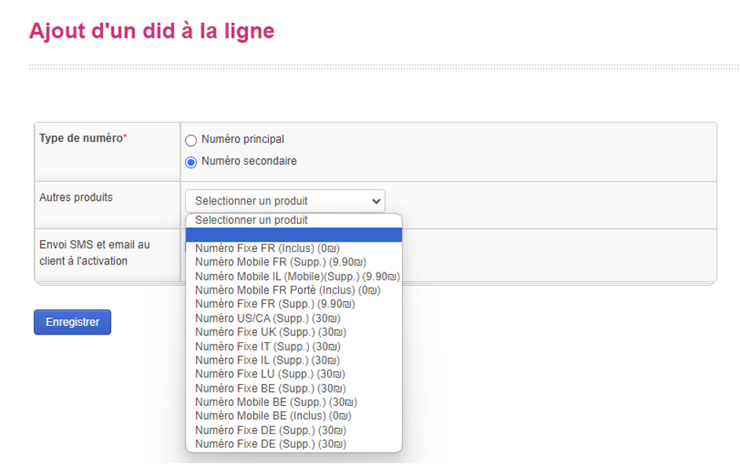
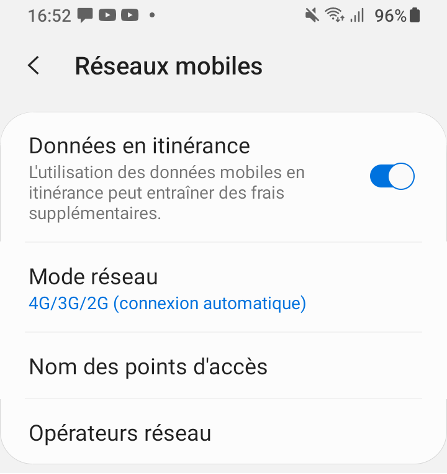

# Mobile

## Notions

### IMEI
L’IMEI est le numéro d’identification unique de chaque téléphone. A l’aide de ce chiffre il est possible de connaitre la marque et le modèle du téléphone utilisé sur la ligne.

### Le Did
Le DID est le numéro de téléphone sur lequel le client est joignable. La plupart des clients d'Annatel (francophones ou anglophones) possèdent plusieurs DIDs associés à leur ligne téléphonique. Le client a la possibilité d'ajouter un ou plusieurs DIDs sur sa ligne, que ce soit des numéros israéliens, français fixes ou mobiles, américains, etc., moyennant des frais supplémentaires en fonction de son abonnement. Selon la législation en vigueur dans certains pays, nous devons demander certains justificatifs au client pour activer un numéro étranger. En l'attente de ces documents, le DID ne s'affichera pas et l'appel sera masqué.  
{: width="800px" } 
  
{: width="400px" } 

### Carte Sim / eSim
Une carte SIM est une carte insérée dans les téléphones pour identifier et authentifier un abonné sur un réseau mobile. Elle contient des informations spécifiques à l'utilisateur, telles que son numéro de téléphone, son identité et ses données d'abonnement (ce que le client peut faire ou non en fonction de son forfait mobile). La carte SIM permet aux utilisateurs de se connecter au réseau mobile de leur opérateur, d'accéder aux services de téléphonie, de messagerie et de données, et de stocker des contacts et des messages. Elle permet également d’être transférée d'un téléphone à un autre, ce qui facilite la migration d'un appareil à un autre tout en conservant les données et les services associés à l'abonnement. Pour la e-Sim, le principe est exactement le même a la différence que la sim n’est plus physique mais est enregistrée directement dans le système du téléphone.

### Infos HLR
Le HLR est un registre qui stocke toutes les données importantes sur le client comme l’identifiant, les services actifs, la localisation, la consommation ainsi que d’autres informations. Il est possible d’avoir accès à ces informations depuis le Backoffice en cliquant sur le bouton action au niveau de la ligne, puis sélectionnez Info HLR.  
{: width="800px" } 
  
{: width="400px" } 

### Roamning
Le roaming, appelé aussi itinérance, permet aux clients de rester connectés au réseau mobile même dans des zones où l'opérateur n’a pas de couverture directe. Le Roaming est surtout utile lors de voyages, c’est avant tout une solution simple de dépannage lors d’un déplacement a l’étranger plus qu’une solution au quotidien. En effet, les recharges de roaming sont disponibles sur une durée limite de 30 jours et les tarifs sont très significativement plus élevés que pour un abonnement classique. Nous proposons des services de roaming dans 59 pays actuellement (la liste des pays est consultable sur le lien suivant: https://www.annatel.co.il/roaming/fr/countries.php). Pour souscrire à une offre de roaming, le client peut le faire seul depuis le lien suivant: https://www.annatel.co.il/roaming/fr/countries.php ou alors nous contacter par WhatsApp ou au téléphone. 
Pour activer une recharge roaming depuis le Backoffice, cliquez sur le bouton action au niveau de la ligne concernée puis sélectionnez Ajout recharge, choisissez ensuite le forfait adapté aux besoins du client et la date d’activation adéquate. Il est également possible de voir dans les plans actifs du client si celui-ci a une recharge roaming active. Enfin, pour vérifier la consommation du client en roaming il est possible de vérifier ça de son côté a l’aide du lien suivant: http://anna.tl/conso ou en envoyant le mot ETRANGER eu 550 par SMS. Le client peut aussi nous contacter pour savoir l'état de sa recharge, cette information se trouve en sélectionnant ma consommation après avoir cliqué sur la touche action au niveau de la ligne. Attention à bien vérifier la consommation depuis l’etranger. 
{: width="800px" } 
  
{: width="400px" } 
  
{: width="800px" } 
  
{: width="400px" } 

### Balances / Consommations
La balance ou la consommation permet de surveiller l'utilisation du forfait par l'abonné. Elle indique ce que le client a déjà utilisé en termes d'appels, de SMS ou de données internet, ce qui permet de déduire ce qui reste à l'abonné. Cette fonction est particulièrement utile car lorsque l'abonné a utilisé la totalité de son abonnement internet, son accès est bloqué. Par conséquent, il est important de vérifier ce paramètre lorsqu'un client nous contacte en raison d'un manque d'accès à internet sur son téléphone mobile. Le client peut vérifier sa consommation en direct via le lien http://anna.tl/conso ou nous contacter, il est possible de vérifier la balance du client depuis les balances ou Ma consommation depuis le bouton action sur la ligne concernée.  
{: width="800px" } 
  
{: width="400px" } 

### Clid
Le Clid (Caller ID) permet d’identifier l’appelant. Il s’agit du numéro de téléphone qui s’affiche chez le destinataire lorsqu’on passe un appel. La grande majorité des clients mobile Annatel possèdent au moin deux numéro de téléphone (un numéro israélien et un numéro français fixe ou mobile en général) il est possible donc de gérer le Clid, cela permet au client de décider du numéro qu’il souhaite affiche lorsqu’il passe un appel (souvent en fonction de la destination de l’appel). Pour gérer le Clid d’un client sélectionnez gestion du Clid après avoir cliquer sur la touche action associée à la ligne concernée. Sélectionnez ensuite l’affichage du numéro en fonction des besoins de l'abonné.
{: width="800px" } 
  
{: width="400px" } 

### MMS
Le MMS est le service de messagerie qui permet d’envoyer non pas un texte comme le SMS mais du contenu multimédia (image, vidéos sons…). Le service MMS n’est pas disponible chez Annatel et ce peu importe le forfait mobile du client.

## SAV Technique

### Internet mobile
- internet mobile est lent:  
Si l'internet mobile est lent, il faut d'abord vérifier la qualité du réseau, avec un minimum de 2 barres de réseau. Si le réseau est faible, se déplacer vers un endroit où le réseau est plus stable est recommandé. De plus, un VPN actif peut également ralentir significativement la vitesse de la connexion.
- pas d'accès du tout a internet
Dans un premier temps, vérifiez si le forfait du client n'a pas été consommé. Ensuite, assurez-vous que les données cellulaires sont activées. (Réglage -> Données cellulaires -> activez Données cellulaire). 

Sur iPhone, redémarrez le téléphone. Si le problème persiste, réinitialisez les réglages réseau du téléphone, tout en notant qu'après cette opération, il faudra se reconnecter aux réseaux Wi-Fi. 
{: width="400px" } 
  
{: width="400px" } 
  
Sur Android, vérifiez que l'APN est correctement configuré en suivant ces étapes : Paramètres -> Réseau et Internet ou Connexion -> Réseau mobile -> Nom des points d'accès -> Ajouter ou + ou 3 points verticaux -> Entrez "annatel" dans le nom et dans APN -> Enregistrez les modifications. Si le problème persiste, réinitialisez les réglages réseau du téléphone. Comme sur iPhone, après cette opération, il faudra se reconnecter manuellement à tous les réseaux Wi-Fi.  
  
{: width="400px" } 
  
{: width="400px" } 
  
{: width="400px" } 
  
{: width="400px" } 
  
{: width="400px" } 
  
- ajouter recharge de giga en Israël
Pour ajouter des gigas internet pour une utilisation en Israël, le client peut le faire depuis le lien suivant: http://anna.tl/data-fr. Les recharges de Giga sont valables 30 jours. Pour ajouter une recharge, le client peut aussi nous contacter. Pour l’activer, suivre exactement les mêmes étapes que pour une recharge de roaming en sélectionnant la recharge adaptée. Enfin, dans le cas où le client manque régulièrement de gigas internet, il est possible de changer son forfait en appuyant sur la touche Upgrade et en choisissant le nouveau forfait adapté. L’activation doit se faire au Billing Day.  
{: width="400px" } 

- Activer le partage de connexion sur Iphone
Sur Iphone le partage de connexion n’est pas activé par défaut, pour l’activer: Réglage - Données cellulaires - Réseau de données cellulaires - Sur tous les champs “Nom du point d'accès entres “annatel”. 
{: width="400px" } 

{: width="400px" } 
  
{: width="400px" } 
  
{: width="400px" } 
  
### Appels
Impossible de joindre un numéro
Si un client rencontre des difficultés à joindre un numéro spécifique, plusieurs problèmes potentiels peuvent en être la cause :
Pour les appels sortants, assurez-vous que le numéro a été composé correctement, en incluant l'indicatif du pays si nécessaire.
Vérifiez que le numéro n'est pas bloqué en tentant de passer l'appel en masqué, en composant #31# avant le numéro.
En dernier recours, supprimer le contact concerné et composer le numéro manuellement peut également résoudre le problème.
Impossible d'émettre ou de recevoir un appel
Si le client ne peut pas émettre ou recevoir d’appels, vérifiez d'abord que ce dernier capte un réseau mobile (à l'aide d’une capture d'écran par exemple), si il n’a pas de réseau, essayez de se déplacer vers un endroit plus susceptible de capter du réseau (pas en sous sol, en extérieur…). Si le problème persiste, éteignez et rallumez le téléphone. Enfin, si le client ne capte toujours pas de réseau alors réinitialisez les paramètres réseaux.
Activer / Désactiver le Renvoie d’appel
Du fait qu'une grande partie de nos abonnés mobile voyagent régulièrement, nous proposons un service de renvoi d'appel (mispari). Cela permet à l'abonné de recevoir ses appels  sur une autre sim lorsque sa sim annatel n'est pas active. Ce service est disponible a 20₪/mois et est gratuit pour les détenteurs de forfaits mobile essentiel plus. Pour activer le Mispari le client peut passer directement via son espace client à l'aide du lien suivant: https://client.annatel.co.il/. Une fois connecté, il lui suffit d’aller sur Abonnements actif, sélectionner la ligne concernée et Activer ou désactiver le Mispari en choisissant la date d’activation et le numéro vers lequel il souhaite rediriger ses appels. 
Le client peut également nous contacter pour gérer le Mispari. Pour ce faire, cliquez sur nouvel espace client - abonnements actifs - Gérer le Misapri. Sélectionnez ensuite la date et l’heure d’activation ou de désactivation du Mispari.  
{: width="800px" } 

{: width="800px" } 

Appeler un numéro spécial / numéro court en France
Pour joindre un numéro court Français, il faudra composer 00330, puis le numéro.
Par exemple pour le 3274 il faudra composer le 003303274.
Pour appeler un numéro spécial en France, il suffit de composer l’indicatif +33 ou 0033 suivit du numéro, sans le premier 0.
Par exemple pour un 0800… il faudra composer le 0033800 ou le +33800…
Appeler vers la France ou vers l’etranger
Pour joindre un contact en France ou a l’etranger il faudra composer le numéro avec l’indicatif avant le numéro de téléphone. +33 en France par exemple.

### SMS
Problème de reception / emission SMS

Impossible de recevoir un SMS depuis un organisme
Pour aider un client qui ne reçoit pas de SMS d'un organisme particulier, voici les étapes à suivre :
Vérifiez d'abord si le SMS ne se trouve pas dans les spams du client. Cela peut arriver, surtout si le SMS contient des liens ou des mots-clés qui déclenchent le filtre anti-spam.
Assurez-vous que le numéro de téléphone du client est bien enregistré auprès de l'organisme en question. Parfois, des erreurs de saisie ou de mise à jour peuvent empêcher la réception des SMS.
Si le client ne reçoit toujours pas de SMS après avoir vérifié les spams et confirmé que son numéro est correct, demandez-lui de nous fournir la date, l'heure de la demande de SMS et le nom de l'organisme auprès duquel la demande a été effectuée. Cela nous aidera à enquêter plus en détail sur le problème.
Il serait également utile de savoir si le client a déjà reçu des SMS de l'organisme en question par le passé. Cela pourrait indiquer s'il y a eu un changement récent dans la configuration du compte ou un problème spécifique à la livraison des SMS.
A l'aide de ces informations nous pouvons potentiellement être en mesure de résoudre le problème du client en retrouvant le SMS ou en contactant l'organisme concerné.
Impossible d’envoyer un SMS
Supprimez le contact ainsi que la discussion en cours et envoyez un nouveau SMS en entrant manuellement le numéro de votre correspondant.
Si vous envoyez un SMS vers l’étranger, assurez-vous de la bonne composition du numéro. Par exemple, lors d’un envoi vers la France, le numéro devra être composé au format international (avec l'indicatif +33 ou 0033 avant le numéro)
Si vous ne pouvez toujours pas envoyer de SMS et que vous utilisez un Android, modifiez le numéro du centre de messagerie (SMSC) par le numéro suivant : +972555000150.

### Hors forfait
Hors forfait internet
Il n’est pas possible de faire de hors forfait d’internet avec un abonnement Annatel. Cela est surtout dans le but de protéger le client, la data étant très coûteuse, surtout depuis l’etranger. L’utilisation internet va donc se bloquer automatiquement. Comme vu précédemment il est possible d'ajouter des recharges internet que ce soit en Israël ou en roaming. A l’etranger le client a toujours accès à whatsapp texte et waze.
Hors forfait appels / SMS
Contrairement à internet , un abonné Annatel peut faire du hors forfait d’appel et de SMS. Pour obtenir le détail des appels facturés en hors forfait cliquez sur le détail des appels au niveau de la facture concernée. La tarification dépend d'où et vers où l'appel ou le SMS ont été émis. Les tarifs à la minute dépendent de la destination de l’appel, le tarif est disponible sur le lien suivant: https://www.annatel.co.il/pdf/Tarifs%20Generaux%20Mobile.pdf  

{: width="800px" } 

### Depuis l’etranger / Vers l’etranger
Whatsapp  texte et Waze
Peu importe le forfait et peu importe si le client a utilisé ou non son forfait internet tous les abonnés annatel dispose de Whatsapp texte et waze en illimité depuis les pays suivants: https://www.annatel.co.il/roaming/fr/countries.php
Pas internet a l’etranger
Vérifiez d'abord que le client dispose d'un forfait qui lui permet d'utiliser Internet depuis l'étranger.
Assurez-vous que le forfait du client n'est pas complètement utilisé. Il peut vérifier cela depuis son espace client en consultant les détails de sa consommation, ou nous pouvons le faire de notre côté en accédant aux informations sur son compte.
Si le client dispose d'un forfait utilisable depuis l'étranger et qu'il lui reste des données disponibles, vérifiez que les données en itinérance ou à l'étranger sont bien activées sur son compte.
Impossible d'émettre un appel depuis l’etranger
Pour appeler depuis l’etranger il faut composer le numéro au format international. Si ça ne fonctionne toujours pas, remplacer le numéro sur la fiche du contact avec le format international.

### Messagerie vocale
modifier le mail de réception de messages vocaux
Il est impossible pour un abonné de modifier le mail de réception de ses messages vocaux. Il doit pour cela, nous contacter. Pour modifier l’adresse mail cliquez sur Voicemail au niveau de la ligne du client puis cliquez sur “configure”. Enfin, vous pourrez changer l’adresse mail ainsi que modifier quelques configurations.  
{: width="800px" } 
  
{: width="800px" } 
  
{: width="300px" } 
  
Consulter ses messages vocaux
Si un client souhaite consulter ses messages vocaux, il lui faut se rendre sur la boîte de réception du mail associée à sa messagerie vocale, s' ils n'apparaissent pas, vérifiez alors les messages spam.  
Modifier l’annonce de la messagerie vocale
Pour modifier l’annonce de la messagerie vocale il suffit de composer le numéro suivant: *151. Le client peut choisir une annonce différente pour chacun de ses numéros de téléphone.

### Portage d’un numéro
Portage d’un numéro Français:
Pour faire porter un numéro de téléphone français il y a plusieurs étapes à suivre:
Il faut dans un premier temps vérifier que le numéro de téléphone est éligible et la ligne doit être active. Si la ligne n’est plus active, l'abonné doit contacter l'opérateur afin de réactiver la ligne.
Ensuite le client doit faire une demande de code RIO auprès de l'opérateur qui héberge le numéro de téléphone. Ce code est indispensable dans le processus de portage d’un numéro de téléphone français. 
Enfin, lorsque le client souhaite faire porter son numéro de téléphone, il doit communiquer le code RIO au nouvel opérateur. Une fois la demande effectuée, le portage devient actif à partir de 5 jours ouvrables minimum. Le portage peut se faire à l'ouverture d’une ligne. Dans ce cas, il faut entrer le numéro à porter, le justificatif de domicile ainsi que le RIO au moment de l’ouverture de la ligne. Il peut également se faire après avoir ouvert la ligne dans ce cas, il faut ajouter un Did mobile FR porte, informer le client du supplément tarifaire et lui demander le code RIO.
Il peut arriver que lors du portage d’un numéro des erreurs de routage ou autres types d’erreur se produisent, dans ce cas il faut se référer directement à Legos, l’organisme qui s’occupe de nous fournir les numéros français.  
{: width="800px" } 
  
{: width="400px" } 
  
Portage d’un numero Israelien:
Il y a trois façons de faire porter un numéro Israelien: à l'aide d’un SMS, d’un appel, d’un document écrit et signé. En général, la façon la plus simple de procéder à un portage est de passer par le SMS sauf cas exceptionnel (Sim casher par exemple). 
Lorsqu'un client souhaite ouvrir une ligne en gardant son numéro de téléphone israelien, il suffit de le stipuler au moment de passer la commande. Ensuite, une fois que le client reçoit sa nouvelle carte SIM (physique ou e-sim), il faut avant de l'installer ou remplacer l’ancienne sim faire la demande de vérification afin de lancer la procédure de portage. Le client peut le faire directement depuis l’espace “activation de sim” depuis notre site, ou nous contacter directement. Dans les deux cas la procédure est la même:
Se rendre dans la rubrique activation sim via le lien suivant: https://www.annatel.co.il/fr_FR/activationsimIII/form
Entrer ensuite le numéro de la nouvelle carte sim ainsi que l’adresse mail. 
Un SMS de vérification est envoyé automatiquement au client
Une fois le code entre la procédure se lance automatiquement et le portage se fait environ 20 minutes plus tard.
Une fois le réseau perdu sur l’ancienne sim, éteindre le téléphone et remplacer la sim avec la nouvelle. 
Si vous utilisez un iPhone, tout se fera automatiquement. 
Si vous utilisez un Android, certains constructeurs nécessitent un réglage manuel. Pour cela, vous devez aller dans : > Réglages > Réseaux et Internet > Réseaux Mobiles > Nom des points d’accès > Ajouter un point d’accès. Saisissez « Annatel » dans les champs Nom et APN puis enregistrez. Sélectionnez ensuite le point d’accès créé. Attention : suivant les constructeurs, les termes exacts peuvent différer.

### Sim casher
Hormis les forfaits mobiles classiques nous proposons également des forfaits Cacher. Ces sims fonctionnent seulement sur les téléphones tamponne Cacher et ne permettent pas d’utiliser internet ni d’envoyer des SMS. Les numéros de téléphone cacher ne peuvent pas être portés. Il est également impossible de faire porter un numéro sur une sim casher. Les forfaits comprennent tous les appels en illimités (4000 minutes) ainsi qu’un numéro de téléphone virtuel fixe francais sous condition de présentation d’un justificatif de domicile français. 