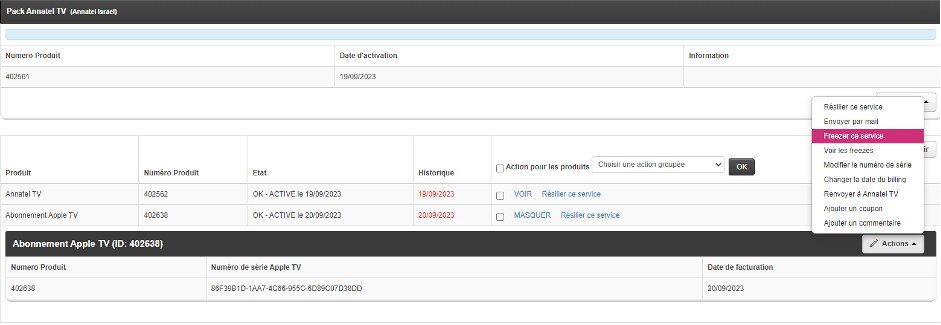

# TV

## Problèmes communs sur les différentes plateformes

### Freezer un service
#### Pack annatel TV 
Notre service TV propose une option gratuite appelée "freeze". Les clients peuvent laisser leur abonnement en pause s'ils voyagent ou n'en ont pas besoin pendant un moment. Pendant cette période, ils ne paient pas l'abonnement. Une fois prêts à reprendre, ils réactivent le service sans frais. C'est simple et flexible pour nos clients. Pour activer un freeze pour un client depuis le Backoffice, il suffit de cliquer sur la touche "action" au niveau de "Annatel TV" et de sélectionner "freezer le service". Le freeze prend effet à partir de la date de facturation du client, ce dernier ayant déjà payé jusqu'à cette date.  
{: width="800px" }

#### Abox  
L’abonnement Abox étant à 99.9₪/mois il est possible de freezer uniquement la Abox pour pouvoir continuer à utiliser annatel tv sans la Abox et ainsi payer 59.9₪/mois. Pour ce faire, cliquez sur la touche “action” au niveau de la “Abox” et sélectionnez “freezer ce service”. Comme dans le cas du pack annatel tv le freeze prend effet à partir de la date de facturation du client.  
{: width="800px" }
#### Apple TV  
Tous les abonnements Annatel tv comprennent dans l’offre une Apple tv offerte. Dès que le client souhaite rajouter une deuxième Apple tv le coût de l’abonnement augmente de 59.9₪/mois. Dans ce cas la il est avantageux pour un client de freezer une Apple TV dans le but de réduire le prix de l’abonnement. Pour ce faire cliquez sur la touche “action” au niveau de la Apple tv et sélectionnez “freezer”. Le freeze prend effet à partir de la prochaine date de facturation.  
{: width="800px" }

### Compte expire suite à un defreeze
Si un client décide de "freezer" son abonnement puis de le "défreezer" à une date différente de celle de leur facturation habituelle, il peut y avoir un problème. Le compte Annatel TV peut être désactivé au jour du billing day. Pour cela sur le bouton “action” il faut cliquer sur “modifier la configuration” et choisir la prochaine date de facturation comme date d'expiration du compte annatel tv.  
{: width="800px" }

### Resynchroniser les produits associés à annatel tv
Lorsqu’un produit associé au compte annatel tv (Apple TV ou Abox) il est possible de resynchroniser l’appareil au compte annatel tv associés. Cela peut être utile quand Abox n’arrive pas a se connecter a internet ou lorsque l’application red bull ou annatel tv ne s’ouvre pas. Pour ce faire cliquez sur le bouton “action” au niveau du pack annatel tv puis sélectionnez “Resynchro tous les produits sur Annatel TV”.  
{: width="800px" }

### Rendez-vous technique
Dans le cas où le problème ne peut être résolu par un conseiller technique au téléphone ou sur whatsapp ou sur simple demande du client, il est possible de faire intervenir un technicien Annatel francophone à domicile. Lorsqu’il s’agit d’un simple SAV technique le coût du déplacement s'élève à 200₪. Pour un installation (Abox ou Apple Tv 3/4) le tarif est de 300₪. En ajoutant le rendez- vous , la facture se génère automatiquement et le technicien valide la facturation après avoir terminé le rendez- vous. Après avoir fixé le rendez- vous, vérifiez que l’agenda de l’installateur a été mis à jour et que l’adresse est bien lisible sur le plan ou sur waze.  
{: width="800px" }

### Chaine Beta
Dans le catalogue de chaîne que nous proposons il y a certaines chaînes qui sont encore en phase bêta. Ces chaînes sont donc plus susceptibles de rencontrer des problèmes techniques (son, image, décalage son image…). Nous ne fournissons pas de service technique sur ces chaînes comme nous ne garantissons pas non plus le fait qu’elle fonctionne parfaitement. 
{: width="800px" }

### Pas de signal
Il est fréquent que des clients appellent le service technique annatel car le message “Pas de signal” s’affiche sur leur téléviseur. Cette erreur apparaît lorsque la Abox ou la Apple Tv sont éteintes ou lorsque le câble HDMI est débranché ou défectueux. Cela ne dépend donc pas des services proposés par Annatel. Il est cependant possible d’expliquer au client l’origine du problème et les étapes à suivre pour le résoudre, à savoir cliquer sur le bouton “source” ou “input” de la télécommande et changer la source, vérifier le branchement et l’état du câble HDMI.

### Identifiant et mot de passe
Dans le cas où le client a perdu son mot de passe il peut obtenir un e-mail de récupération en renseignant son adresse mail puis en cliquant sur mot de passe oublié. Il est également possible de nous contacter au téléphone ou via WhatsApp pour obtenir ou modifier son mot de passe après avoir eu confirmation qu’il s’agissait bien du titulaire du compte (4 derniers chiffres du moyen de paiement). Il est également possible pour un client d’obtenir un identifiant et un mot de passe court, cela est particulièrement utile pour se connecter à l'aide d’une smart TV ou encore d’une Apple TV. Les codes courts sont disponibles depuis le backoffice. Parfois, ces codes peuvent s’avérer être aussi compliquer, il nous est donc possible de les modifier via http://annatel.tv/admin.php  
{: width="800px" }

### J’ai l’image mais pas le son ou inversement
Certains clients se plaignent d'avoir l'image mais pas le son. Dans ce cas, il faut vérifier l'état ou le branchement du câble HDMI, ainsi que le niveau de son de la télévision ou de la Abox pour s'assurer qu'il n'est pas en mode muet et qu'il est suffisamment élevé. Si le client a le son mais pas l'image, le problème provient probablement du câble HDMI.

## annatel.tv

### Login ou mot de passe incorrect
Plusieurs facteurs peuvent causer ce message d’erreur sur la page de connexion à annatel tv. Tout d'abord il faut s’assurer que le login et le mot de passe sont écrits correctement, que les majuscules sont respectées ou encore qu’il n’y a pas d’espace avant le premier caractère. Il est possible de vérifier cela en cochant la case “voir le mot de passe”. Ensuite, cela peut provenir aussi d’un changement du mot de passe automatique suite à de trop nombreuses tentatives de connexion ou encore lorsque trop d’appareils se sont connectés simultanément avec le même identifiant. Dans ce cas le client peut cocher la case “J’ai oublié mon mot de passe” et obtenir un mail de récupération ou alors demander à un conseiller un nouveau mot de passe en fournissant une preuve qu’il s’agisse bien du titulaire du compte (4 derniers chiffres du moyen de paiement, adresse, numéro de teoudat zeout…).  
{: width="800px" }

### Ecran noir sur la chaine
Sur certains modèles de smart TV le lecteur des chaînes par défaut n’est pas compatible. Pour régler ce problème il est possible de changer manuellement de lecteur en dessous de la vidéo jusqu'à obtenir l’image et le son de la chaîne.  
{: width="500px" }

### La chaîne met du temps a charger ou image saccadée
Étant sur une page internet si cette dernière met du temps a charger ou que l’image est de mauvaise qualité/coupe il faut donc vérifier la connexion internet et privilégier une connexion par câble ethernet plutôt que par wifi.

### La qualité de l’image n’est pas bonne
Comme mentionné précédemment, il faut dans un premier temps vérifier la connexion internet. Dans le cas où la connexion est bonne, il est possible de changer manuellement la qualité de l’image. Pour cela il suffit de cliquer sur la barre au bas de la vidéo et sélectionner une meilleure qualité d’image.  
{: width="500px" }
  
{: width="500px" }

### Impossible d'accéder au site annatel.tv ni a acun autre site annatel
Il se peut que certains opérateurs internet bloquent les adresses IP des différents sites Annatel. Pour vérifier que le client est bien dans ce cas de figure, il suffit de lui demander de se connecter aux différents sites internet d’Annatel (annatel.tv, annatel.co.il…). Si il lui est impossible de se connecter à ces sites alors il faut contacter son fournisseur d'accès internet et vérifier directement auprès de ces derniers.

### Ajouter une télécommande sur annatel.tv

### Compte expire, pas toutes les chaînes disponibles
Lorsqu’on se connecte a Annatel.tv alors que le compte est expiré alors il est impossible d’avoir accès à la totalité des chaînes et du replay. Dans ce cas, le client a accès à 15mins de visionnage par jour sur seulement 13 chaînes du bouquet. Si il souhaite passer à l'abonnement premium et avoir accès illimité aux chaînes du bouquet il suffit d’ajouter un moyen de paiement en cliquant sur la touche “premium” et souscrire a l’abonnement annatel.tv 
{: width="800px" }

## Abox

### Les principales touches sur la télécommande Abox

### Ajouter, remplacer, supprimer une Abox d’un compte
Pour se connecter à Annatel TV à l'aide de la Abox il n’y a pas besoin de rentrer son identifiant et son mot de passe comme sur le site internet. La connexion se fait automatiquement quand le numéro de série de la Abox est relie au compte du client. Pour cette raison, lorsqu’un client souhaite modifier sa Abox en achetant une nouvelle il faut la modifier également sur le backoffice et entrer le numéro de série correspondant. Dans le cas ou il s’agit d’un ajout de Abox il faut ajouter le service Abox en cliquant sur le bouton “action” au niveau du “Pack Annatel Tv” puis sur “Ajouter le service Abox”,  notifier le client de la modification tarifaire (de 59.9₪/mois à 99.9₪/mois pour la première Abox. +49.9₪/mois à partir de la seconde Abox ainsi que l’achat de la Abox a 1200₪ payable en 12 fois sans frais) et entrer le nouveau numero de serie.  
Enfin, dans le cas où le client ne souhaite plus utiliser une Abox ou souhaite récupérer la Abox d’un ami ou d’un membre de sa famille, il faut dans un premier temps “libérer la MAC” et sélectionnez “la remettre dans le stock”, car une Abox ne peut être associée qu'à un seul compte. Une fois la MAC libérée, il est possible d’associer le numéro de série au nouveau compte.  
{: width="800px" }
  
{: width="800px" }
  
{: width="800px" }

### Abox pas connectée à internet
Sur les différents modèles de Abox il est très simple de vérifier si elle est connectée à internet ou non. En effet en haut à droite de l'écran il est inscrit Abox cela signifie que cette dernière n’est pas connectée à internet. Dans le cas contraire, sont affichés la date et l’heure (comme ci-dessous).  
La première solution est toujours de débrancher puis rebrancher la Abox. Si le problème persiste et que la connexion se fait par câble ethernet alors, il est possible qu’en débranchant puis rebranchant simplement le câble ethernet de la Abox ou en changeant le port ethernet sur le routeur la connexion soit rétablie.  
{: width="800px" }

Lorsque la Abox n’est pas connectée à internet, il faut la connecter pour pouvoir accéder aux services Annatel. Pour cela, il faut cliquer sur “top menu” - “Réglages” - “réseau” pour la suite cela dépend si le client possède une Abox original ou 4k:  
- pour une Abox originale (Dune HD):  
Sélectionnez le mode de connexion Wi-fi ou câble.  
Par câble : Il est toujours mieux de privilégier ce type de connexion. Cela permet un meilleur débit et une connexion plus stable. Dans la page réseau, sélectionnez câble (ethernet) au niveau de “connexion” puis cliquez sur appliquer au bas à gauche de l'écran. La Abox est connectée une fois que l’adresse IP est trouvée sur la partie supérieure de l'écran et lorsque la date et l’heure sont affichées.  
{: width="800px" }
Par Wi-fi: Sélectionnez Wi-fi (sans fil) - balayer les réseaux - sélectionner son réseau wifi - entrer le code wi-fi si besoin. Pour taper le code wifi il est possible de le faire avec le clavier sur la télécommande ou d’afficher le clavier directement sur l'écran en appuyant sur la touche “D” (en bleu) sur la télécommande. Appuyez sur Appliquer pour finaliser l’action.  
{: width="800px" }
  
{: width="800px" }
  
- Pour les Abox 4k(v1, v2 ou v3):  
Après avoir appuyé sur la touche “Top menu” sur la télécommande, sélectionnez “Réglages” - “Réseau”. Vous verrez l'écran divisé en deux parties. La partie supérieure pour la connexion par câble ethernet la partie inférieure pour la connexion sans fil.  
Par câble : Comme mentionné précédemment il est toujours préférable de choisir ce mode de connexion, cela permet un débit plus important et une connexion plus stable. Pour se connecter par câble, sur la partie supérieure de l'écran, cliquez sur “edit settings” - “Automatique DHCP” et enfin “Appliquer”. La connexion est établie après un chargement de quelques secondes et l’adresse IP apparaît sur la partie supérieure de l'écran.  
{: width="800px" }
  
{: width="800px" }  
Par Wi-fi : Apres avoir clique sur “Réglages” puis “Réseau”, sur la partie inférieure de l'écran cliquez sur “Edit Settings”, activez le Wi-fi en cliquant sur “Enable Wi-Fi” si ce n’est pas déjà fait, puis sélectionnez “Balayer les réseaux”, Choisissez votre Wi-fi et entrez le mot de passe si besoin. Pour afficher le clavier sur l'écran, appuyez sur la touche “D” en bleu sur la télécommande.  
{: width="800px" }
  
{: width="800px" }
  
{: width="800px" }  

### Erreur code 1
Lorsqu’un client essaie d'accéder aux chaînes sans être connecté à internet ou lorsque la connexion se perd pendant le visionnage de la télévision le message d’erreur “erreur code 1”. Pour enlever ce message cliquez sur la touche “top menu” et reconnectez la Abox a internet (voir instructions précédentes).

### Image qui fige, chargement à l'écran
Il s’agit sûrement du problème le plus récurrent chez les utilisateurs de la Abox.
Dans le cas ou l’image s'arrête régulièrement et un chargement apparaît à l'écran cela veut dire que la connexion internet n’est pas suffisamment bonne. Dans un premier temps débranchez puis rebranchez la Abox. Vérifiez que le câble ethernet est bien branché si la connexion est filaire. Après cela vérifiez la vitesse de connexion internet. Pour cela il est possible de faire un test de vitesse internet directement depuis la Abox en appuyant sur “Top menu” - “Annatel TV” - “Assistance” - “Test de vitesse” - “1M”, a ce moment un nombre va s’afficher à l'écran en Mb/s(cf image ci dessous). Dans le cas où la vitesse est inférieure à 30Mb/s, il faut s’assurer que la distance entre la Abox et le routeur Wi-fi n’est pas trop importante (même étage, miklat, beaucoup de murs porteurs). Si l’emplacement de la Abox par rapport au routeur est bon, il faut alors rapprocher la Abox du routeur ou bien considérer l'utilisation d' un répéteur Wi-Fi pour connecter la box en filaire. Dans le cas où le résultat est supérieur à 30Mb/s, resynchroniser la Abox depuis le backoffice avant de la débrancher ou alors la réinitialiser complètement.  
Enfin, il est quand même préférable dans tous les cas de contacter le fournisseur d'accès Internet afin de vérifier que le réseau, le débit et l'infrastructure fonctionnent correctement. En effet, les résultats, qu'ils soient bons ou mauvais, peuvent ne pas toujours refléter toutes les données pertinentes. Il est possible que certaines informations importantes ne soient pas visibles uniquement à partir du résultat du test. Il pourrait y avoir d'autres éléments à prendre en compte qui se cachent derrière ces résultats.  
{: width="800px" } 

### La télécommande ne répond pas
Aussi évident que cela puisse paraître, dans le cas où la télécommande ne répond plus, il suffit simplement de changer les piles. Dans le cas où les piles sont neuves essayer de bien se placer en face de la Abox et vérifier qu’il n’y ait pas d’obstacle entre vous et le boîtier (porte du meuble tele, meuble…). Enfin si malgré tout cela le problème persiste, sur les Abox originales seulement verifier le recepteur infrarouge ou changer de télécommande. Pour se procurer une télécommande, il est possible de venir directement dans nos bureaux, notre boutique, les différents points relais en Israël ou encore par envoie postale. La télécommande est disponible au prix de 129₪.

### Programme non disponible / ecran de chargement sur la partie droite de l'écran
Lorsque l’heure n’est pas bien configurée sur la Abox la liste des programmes n’est pas disponible et un écran de chargement gris légèrement transparent apparaît sur la partie droite de l'écran. Pour enlever cet écran de chargement et afficher les programmes il faut configurer le fuseau horaire et sélectionner le bon, (GMT+2).
Sur la Abox originale: “Top  Menu” - “Réglages” - “Date et heure”. Depuis ce menu vous pouvez changer le fuseau horaire et donc sélectionner “GMT +02:00” (Israel).  
{: width="800px" }  

Sur les Abox 4k: “Top Menu” - “Réglages” - “Général”. Déroulez le menu au niveau de “Fuseau horaire”, et sélectionnez “GMT +02:00 (Jerusalem)”.  
{: width="800px" } 

### Action du power
Dans de nombreux cas de problèmes techniques rencontrés par les clients, débrancher et rebrancher simplement la Abox suffit à résoudre le problème. Cependant, avec certaines personnes, cette action peut entraîner plus de problèmes au lieu de résoudre le problème initial. En effet, en débranchant le câble ethernet ou le câble HDMI au lieu du câble d’alimentation cela peut déconnecter la Abox ou bien ne plus avoir de source sur le téléviseur. Pour cela, il est possible de modifier un paramètre de la Abox afin d'éviter au client de devoir toucher aux câbles tout en redémarrant la Abox. Pour cela, allez sur le menu principal à l'aide de la touche “Top menu” puis cliquez sur “Réglages” - “Divers” - “Gestion de l’alimentation” et au niveau de “Action du power” faites dérouler le menu et sélectionnez “Éteindre”.  
Cela permet d'éviter de toucher aux câbles et d'éteindre et rallumer la Abox en utilisant uniquement la télécommande (touche power en haut à droite).
### Télévision Hisense
Les téléviseurs Hisense utilisent les mêmes fréquences télécommandes que celles des Abox. Cela peut donc entraîner des interférences et rendre l’utilisation du téléviseur et de la Abox très délicate. Une solution possible est de prendre un récepteur infrarouge externe à brancher à l'arrière de la Abox.

### La Abox est dans une autre langue
Après un redémarrage ou une réinitialisation de la Abox, il se peut que la langue soit changée. Pour remettre la langue en francais : “Top menu” - “Réglages” (icône orange avec une roue) - “Général” (même icône que réglage, en haut à gauche) et faire dérouler le menu sur la première ligne. Sélectionnez le français.  
Sur Abox originale:  
{: width="800px" } 
Sur Abox 4K:  
{: width="800px" } 

### Réinitialiser la Abox
Dans le cas où le client rencontre un problème récurrent avec sa Abox ou lorsque toutes les manipulations effectuées sur la Abox ne permettent pas de régler le problème alors la réinitialisation de la Abox est une option a considéré.  
Pour se faire: “Top menu” - “Réglages” - “Général” - faites dérouler le menu “Réinitialisation des paramètres” et sélectionnez “réinitialisation complète" ou “reset settings” en fonction du modèle. La Abox va s'éteindre et s'allumer seule.  
{: width="800px" } 

### IPV4 / IPV6
Il existe aujourd’hui deux versions d’IP. L’IPV4 est la version la plus ancienne et la plus courante permet de connecter un nombre limité d’appareils en simultané. L’ipv6 est la version la plus récente et permet de connecter un nombre quasiment illimité d’appareils au réseau internet. Le flux tv est envoyé par défaut en IPV4, certains clients possédant l’IPV6 peuvent avoir du mal à recevoir le flux correctement, dans ce cas il nous est possible de passer par un serveur vidéo qui nous permet de forcer le flux en IPV6 directement et d’éviter la conversion (via http://annatel.tv/admin.php). Ainsi, le client devrait rencontrer moins de problèmes de chargement. Modifier le serveur ne se fait qu’en cas de dernier recours et seulement dans le cas où tout fonctionne normalement chez le client. Ce n’est pas une solution systématique pour régler un souci technique et il est important d’effectuer toutes les vérifications nécessaires et habituelles avant de changer l’IPV.

### Réinstallation ou redémarrage Abox
Pour installer ou démarrer une Abox suite à une réinitialisation il faut suivre exactement les mêmes étapes. Les paramètres proposés par défaut sur la Abox sont en général ceux qu’il faut choisir. Attention quand même à bien choisir le fuseau horaire GMT+02:00.

## Apple tv

### Apple tv 3

#### Fonctionnement de Annatel tv sur Apple TV 3 / Accès à Annatel via Red Bull
Sur les plus anciennes versions d’Apple TV, il est impossible de télécharger des applications. Pour cette raison, nous utilisons un hack sur l’application Red Bull. De ce fait, nous ne garantissons pas que ce hack fonctionnera indéfiniment. Pour pouvoir avoir accès aux chaînes Annatel TV sur Red Bull il faut donc changer manuellement le DNS pour rediriger la connexion de Red Bull vers Annatel TV. Pour cela, aller dans “Reglages” - “General” - “Réseau” puis en fonction du type de connexion:  
Ethernet: Cliquez sur “Ethernet” - “Configurer la connexion internet”  
Wi-Fi: Cliquez sur votre réseau Wi-Fi puis sur “Configurer la connexion internet”
Vérifiez que l’adresse IP est bien automatique puis configurez le DNS en manuel. Une série de chiffres va apparaître à l'écran. Il va falloir donc modifier le DNS en entrant l’adresse suivante: 082.080.192.230 une fois l’adresse bien entrée, les chaînes Annatel apparaîtront dans l’application Red Bull.  

#### Ajouter, remplacer, modifier une Apple tv 3 d’un compte
Avec l’abonnement Annatel Tv a 59.90₪/mois, il est possible d’avoir une Apple Tv connectée. Si un client souhaite ajouter une deuxième Apple Tv ou plus il faut donc compter en plus, 59.90₪/mois et par Apple Tv supplémentaire.  
Pour ajouter une apple tv 3, si il s’agit de la première Apple Tv sur le compte alors le client peut entrer le DNS se connecter sur Red Bull et la Apple sera ajoutée automatiquement sur le Backoffice. Si il s’agit de la deuxième Apple Tv ou plus, l’ajout ne peut se faire qu’avec un conseiller Annatel en ligne ou sur WhatsApp. Pour le faire, cliquez sur le bouton “action” au niveau du “Pack Annatel Tv” et sélectionnez “Ajouter le service abonnement Apple Tv” et entrez le numéro de série de la Apple Tv.  
{: width="800px" } 
Pour remplacer une Apple Tv 3 par une autre, cliquez sur le bouton “action” au niveau de la Apple tv et sélectionnez “Modifier le numéro de série”. Si le client ne possède qu’une seule Apple Tv il est également possible de Résilier la Apple Tv depuis le Backoffice et le client a juste a se connecter normalement.  
{: width="800px" } 
Pour supprimer une Apple Tv 3 d’un compte annatel tv, cliquez sur le bouton “action” au niveau de la Apple tv et sélectionnez “Résilier ce service”.  
{: width="800px" } 

#### Ou trouver le numero de serie de la Apple Tv 3
Comme vu précédemment pour ajouter ou modifier une apple tv 3. Entrez dans les “Réglages” - “Général” - “Information”. Sur la seconde ligne vous verrez le numéro de série de la Apple Tv.  
{: width="800px" } 

#### Ordinateur et réglages, probleme de connexion internet
Lors d’une coupure de courant ou lorsque le signal internet est perdu, la Apple tv 3 va afficher uniquement les icônes ordinateur et réglages. Pour afficher les applications et notamment redbull tv, il faut reconnecter la Apple TV a internet.
Pour cela: cliquez sur “Réglages” - “Général” - “Réseau” puis en fonction de la connexion:  
Ethernet: Cliquez sur “Ethernet” - “Configurer la connexion internet”. Au niveau de l’IP vérifier qu’elle soit bien en automatique. Si le DNS est en automatique alors passez le en manuel et entrez l’adresse DNS d’Annatel TV. Si le DNS est déjà en manuel alors passez le en automatique dans un premier temps puis repassez le en manuel en entrant la bonne adresse DNS.(cf plus haut).  
{: width="800px" } 
Wi-fi: Sélectionnez le nom du réseau Wi-fi, connectez vous au réseau, configurez la connexion internet, vérifiez que l’IP est bien en automatique. Puis, vérifiez le DNS et comme expliqué pour la connexion en ethernet, si il est en automatique passez le en manuel, si le DNS est en manuel alors passez le en automatique puis repassez le en manuel et entrant a la bonne adresse DNS. (cf plus haut). 
{: width="800px" }  

{: width="800px" }  
Une fois l’IP et le DNS bien configurés, retourner au menu principal. Toutes les applications devraient à nouveau apparaître et Annatel tv est disponible sur l’application Red Bull.

#### Red Bull tv non disponible
Plusieurs facteurs peuvent être à l’origine de ce message d’erreur lorsqu’on rentre sur l’application Red Bull.  
- L’utilisation de Red Bull pour voir Annatel résulte d’un hack. Parfois ce hack peut ne plus fonctionner temporairement et le message d’erreur va s’afficher à l'écran. Dans ce cas, les développeurs s’occupent de régler le bug au plus vite. Il est donc malheureusement impossible pour le client de faire quoique ce soit pour avoir les chaines sur Red Bull en attendant.  
- Lorsque le compte du client est expiré (suite à un défaut de paiement, defreeze..)  
- Lorsque la Apple tv n’est pas  connectée à internet. Dans ce cas, vérifier la connexion. En Wi-fi en allant dans “Réglages” - “Général” - “Réseau” puis en sélectionnant votre wifi. Par câble ethernet en vérifiant que le câble est bien branché du côté de la Apple tv et du boîtier internet. Ne pas hésiter à le débrancher des deux côtés voire même de changer le port ethernet sur la box internet.  

#### Réinitialiser la Apple tv 3
Dans le cas où le problème du client persiste, que la apple tv ne se connecte pas a internet ou qu’il est impossible de changer le DNS il est possible en dernier recours de réinitialiser la Apple TV. Pour cela cliquez sur “Réglages” - “Général” - “Réinitialiser” - "Réinitialiser tous les réglages". La Apple TV va s'éteindre et se redémarrer toute seule.

### Apple tv 4K

#### Ajouter, remplacer, modifier une Apple tv 4K d’un compte
Avec l’abonnement Annatel Tv a 59.90₪/mois, il est possible d’avoir une Apple Tv connectée. Si un client souhaite ajouter une deuxième Apple Tv ou plus il faut donc compter en plus, 59.90₪/mois et par Apple Tv supplémentaire.  
Pour ajouter une Apple Tv à son compte Annatel: s' il s’agit de la première Apple Tv sur le compte (3eme et 4eme génération confondue), il suffit au client de se connecter avec ses identifiants Annatel sur l’application Annatel Tv. Le numéro de série de la Apple TV va se mettre automatiquement sur le Backoffice. A partir de la deuxième Apple Tv, le processus est différent. Le client ne peut configurer Annatel sur la Apple Tv sans l’aide d’un conseiller Annatel en ligne ou sur Whatsapp. Le client doit se connecter normalement à l'aide de ses identifiants sur l’application Annatel Tv sauf qu’un message d’erreur va s’afficher “Une Apple TV est déjà configurée…”  avec un QR code et le numéro de série de la Apple Tv.  

#### Numero de serie de l’Apple TV 4K
Comme pour la Apple TV 3, les Apple TV 4K sont enregistrées sur le Back Office à l’aide d’un numéro de série. En revanche si sur Apple TV 3 il s’agit directement du numéro de série d’usine de l’Apple TV pour les Apple TV 4K nous utilisons le numéro de série qu’on peut trouver sur l’application Annatel dans l’onglet “Mon compte” - “AppleTv:”  
{: width="800px" }  

#### Remplacer une Apple tv 3 par une Apple tv 4K
La Apple Tv 3 n'étant plus prise en charge par Apple depuis plusieurs années, nombre de nos clients se décident à passer à la Apple tv 4. Cela permet aussi d'éviter à entrer le DNS ou encore être à l'abri d’un arrêt soudain du hack de Red Bull Tv. Pour remplacer une Apple Tv 3 par une 4ème génération, résiliez la Apple Tv 3 et ajouter la 4 selon la procédure vue précédemment.

#### Telecharger l’application annatel tv
Sur Apple tv 4, contrairement a la 3eme génération, il est possible de télécharger des applications directement depuis l’App store. Pour cette raison, nous avons développé l’application Annatel. Cela permet de ne pas passer par un contournement du système et d’avoir à faire la manipulation du DNS. Annatel Tv étant disponible que depuis le territoire Israelien (Gaza compris cheh), l’application est disponible que depuis l’App store Israelien pour 59.9₪. Une fois que le client a acheté l’application une fois sur un de ses appareils il n’aura pas besoin de l’acheter pour ses autres Apple TV. Il faut donc distinguer deux cas pour qu’un client puisse télécharger l’application.  
- Le client possède un compte app store israelien.  
Le cas le plus simple est lorsque le client souhaitant télécharger l’application Annatel Tv possède un compte App store Israelien. Dans ce cas, il suffit au client d’entrer Annatel TV dans la barre de recherche sur l’App store et de télécharger l’application. Les 59.9₪ seront prélevés directement depuis son compte Apple (une fois seulement évidemment).  
- Le client ne possède pas de compte app store israelien.  
Si le client ne possède pas de compte App store Israelien alors 2 options s’offrent à lui. Tout d'abord, il est possible de changer la région de son compte. Malheureusement cela n’est possible que depuis le compte Icloud et donc sur un Iphone connecté avec le même identifiant ou depuis un navigateur. Il est aussi important de noter que si le client a souscrit à des abonnements via son compte Icloud (VPN, Jeux…) ces derniers seront résiliés lors du changement de région du store. Une fois le compte connecté au store isralien le client n’a plus qu'à rechercher l’application Annatel TV dans la barre de recherche et la télécharger normalement.
Si il est impossible pour le client de changer la région de son store (abonnements actifs en cours, pas accès à son icloud, personne age…) alors nous pouvons “prêter” le temps de télécharger l’application un compte Apple store israelien.Dans ce cas, le client sera facturé du prix de l’application depuis son compte Annatel directement. Cette manipulation ne peut se faire qu’en ligne avec un conseiller technique. Pour ce faire, entrez dans les Réglages - Utilisateurs et comptes - Ajouter un utilisateur. Les identifiants sont les suivants:  
login: appletvannatel@icloud.com, mot de passe: Ann@tel2023
Choisissez ensuite un numéro de téléphone pour recevoir le SMS d'authentification à deux facteurs. Dans le menu “Utilisateurs et comptes” cliquez sur le compte Annatel puis passer ce profil en “profil actif”. Une fois le compte actif il est désormais possible d’aller sur l’App store et de télécharger l’application normalement. Une fois le client connecté à Annatel TV, retournez dans les Réglages - Utilisateurs et comptes - Sélectionnez l’utilisateur Annatel et cliquez sur “Supprimer l’utilisateur de l’Apple TV”. Cela n’a évidemment aucune incidence sur l’application et le client pourra continuer à l'utiliser normalement.  
{: width="800px" } 
  
{: width="800px" } 

#### Demande de vérification du compte Appletvannatel@icloud.com
Lorsque le client n’a pas supprimé le compte apple Annatel après l’avoir utilisé pour télécharger l’application, la Apple TV peut demander une vérification du mot de passe. Pour que le message d'erreur ne réapparaisse pas, il suffit de supprimer le compte Annatel sur le Apple TV. Pour ce faire, allez dans les Réglages - Utilisateurs et comptes - sélectionnez l’utilisateur appletevannatel puis au bas du menu cliquez sur “Supprimer l’utilisateur de l’Apple TV”. Une fois l’utilisateur supprime le message de vérification du mot de passe n'apparaîtra plus et il sera évidemment toujours possible d’utiliser l’application Annatel TV.  
{: width="800px" } 

#### Error launching application
Lorsque l’application Annatel est ouverte depuis longtemps sur l' Apple TV ou quand la connexion internet s’est perdue pendant que l’application était ouverte, le message d'erreur “Error launching application” apparaît à l'écran lors de l’ouverture de l’application. Pour enlever ce message et accéder aux chaînes, vérifiez dans un premier temps que l’Apple TV est bien connectée à internet, ensuite, cliquez deux fois rapidement sur la touche “TV” sur la télécommande de l’Apple TV, l'écran va se réduire et il sera possible de fermer les applications ouvertes en arrière plan en balayant l’application vers le haut. Si cette manipulation est trop compliqué pour le client, ou si ce dernier a configure une télécommande universelle qui n’a pas la touche permettant de fermer les application ouvertes il faudra entrer sur l’application Annatel laisser le message d’erreur s'afficher et débrancher le câble d’alimentation de l’Apple TV. Une fois le cable rebranche et l’Apple TV allumée, retournez sur l’application Annatel TV et utilisez la normalement.  
{: width="800px" } 

#### Ecran noir sur l’application
Il se peut que dans certains cas le client tombe sur un ecran noir lorsqu’il ouvre l’application. Dans ce cas, procédez exactement de la même façon que pour l’erreur “Error launching application”.

#### Liste des programmes pas actualisée
Sur la liste des chaînes, le nom des programmes ne s’actualise pas automatiquement. Pour actualiser glisser le curseur sur “VOD par date” ou “VOD par catégorie” et revenez sur la liste des chaînes. Le nom des programmes sera actualisé.
